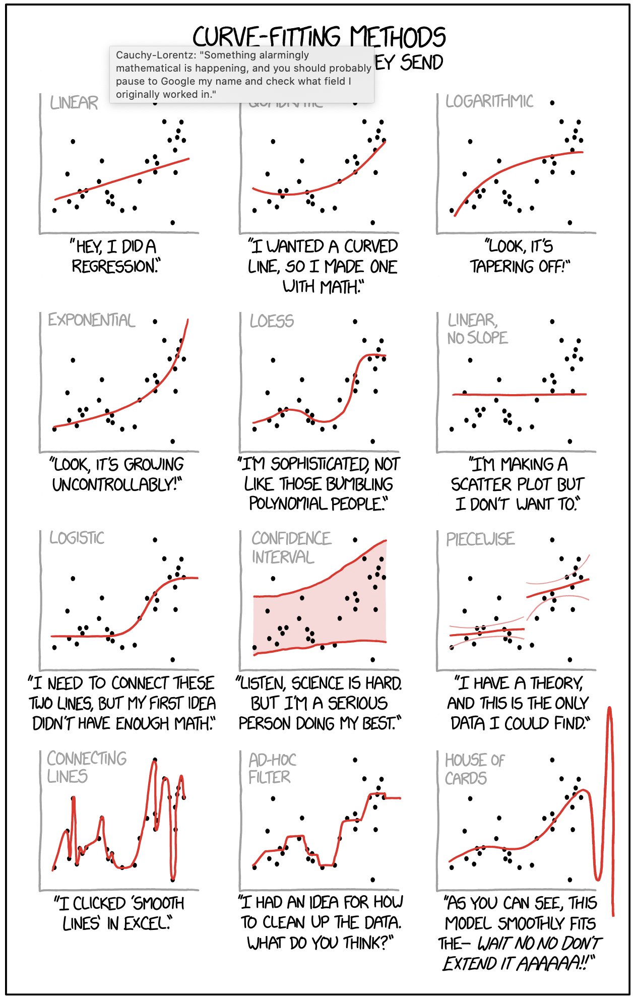
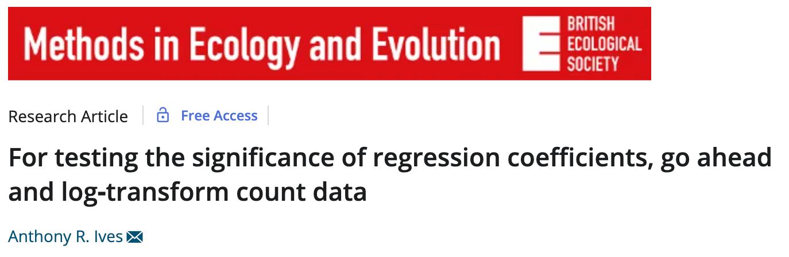
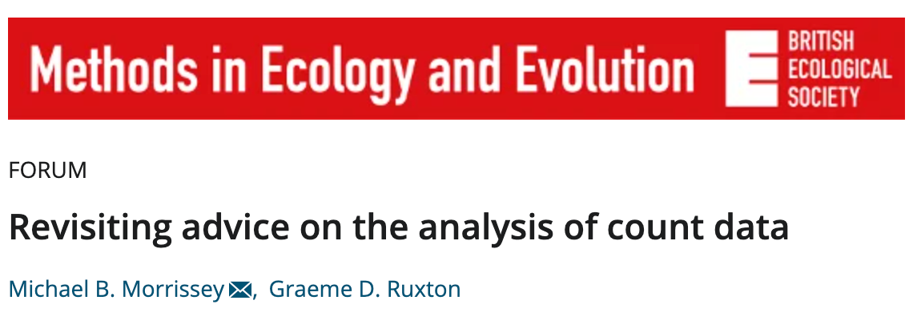

Common Sense Statistics
========================================================
author: Ignasi Bartomeus
date: 2025
autosize: true

Feedback: <a href="nacho.bartomeus@gmail.com"> nacho.bartomeus@gmail.com</a>

[Bluesky @ibartomeus](https://bsky.app/profile/ibartomeus.bsky.social)

Common Sense Statistics
========================================================


1. Have a question
========================================================

Know your goal:

- exploratory analysis
- null hypothesis testing
- assessing the plausibility of different models
- interested in the model predictive power

1. Have a question
========================================================




2. Do not expect statistics to be easy
========================================================

- Dynamic field
- Opinionated field
- No cookbooks

> “If you only have a hammer, all your problems will look like nails”

(but do not overdue it -> statistical machismo)


2. Do not expect statistics to be easy
========================================================




2. Do not expect statistics to be easy
========================================================



3. Be aware that statistical analysis can hardly fix a bad experimental design or poorly collected data.
========================================================

> "calling a statistician after the data has been collected is like calling a doctor to do an autopsia"

- Experimenta design
- Sample size
- (Power analysis)

4. Learn about researchers degrees of freedom
========================================================

- The Garden of forking paths
- p-hacking
- Pre-registration?


5. Always plot your data
========================================================


5. Always plot your data
========================================================


6. Understand the statistical test you are performing
========================================================

- model assumptions
- default parameters
- toy datasets
- interpretation

7. Provide the full details of your statistical analyses.
========================================================

- Report all test and data manipulation
- Frequentist: P-value, sample size, estimates and associated errors (SE or CI), coefficient of determination (r2), and interpretable effect sizes.
- Do not create Post-hoc hypothesis
- Bayesian CI's ~ p-values


8. Biological significance > statistical significance
========================================================


8. Biological significance > statistical significance
========================================================


```

Call:
lm(formula = d$values ~ d$treatment)

Residuals:
    Min      1Q  Median      3Q     Max 
-5.7940 -1.3562 -0.2033  1.2013  6.0050 

Coefficients:
                     Estimate Std. Error t value Pr(>|t|)    
(Intercept)           20.7825     0.2037 102.036  < 2e-16 ***
d$treatmenttreatment  -1.0960     0.2880  -3.805 0.000189 ***
---
Signif. codes:  0 '***' 0.001 '**' 0.01 '*' 0.05 '.' 0.1 ' ' 1

Residual standard error: 2.037 on 198 degrees of freedom
Multiple R-squared:  0.06814,	Adjusted R-squared:  0.06343 
F-statistic: 14.48 on 1 and 198 DF,  p-value: 0.0001889
```

8. Biological significance > statistical significance
========================================================


8. Biological significance > statistical significance
========================================================


```

Call:
lm(formula = d$values ~ d$treatment)

Residuals:
    Min      1Q  Median      3Q     Max 
-6.3779 -2.6385 -0.7762  1.1683 12.5558 

Coefficients:
                     Estimate Std. Error t value Pr(>|t|)    
(Intercept)           21.1198     0.4244  49.758   <2e-16 ***
d$treatmenttreatment   0.5667     0.5695   0.995    0.321    
---
Signif. codes:  0 '***' 0.001 '**' 0.01 '*' 0.05 '.' 0.1 ' ' 1

Residual standard error: 3.796 on 178 degrees of freedom
Multiple R-squared:  0.005532,	Adjusted R-squared:  -5.467e-05 
F-statistic: 0.9902 on 1 and 178 DF,  p-value: 0.321
```

8. Biological significance > statistical significance
========================================================


9. Practice Open Science and reproducibility
========================================================

- Document choices (Git)
- Pair programming
- Code review
- Errors are fine as long as are honest and we catch them.


Common Sense Stastistics
========================================================
1. Have a question
2. Do not expect statistics to be easy
3. Be aware that statistical analysis can hardly fix a bad experimental design or poorly collected data
4. Learn about researchers degrees of freedom
5. Always plot your data
6. Understand the statistical test you are performing
7. Provide the full details of your statistical analyses
8. Biological significance > statistical significance
9. Practice Open Science and reproducibility


Class structure
=======================================================

- There are lots of online R courses and books
- Here we come to make mistakes
- Here we come to solve problems
- Here we come to discuss

Aims
=======================================================

- Learn you can do anything with R.
- Know how to google it.
- Lose the respect for R.


Why R?
========================================================

>R has simple and obvious appeal. Through R, you can sift through complex data sets, manipulate data through sophisticated modeling functions, and create sleek graphics to represent the numbers, in just a few lines of code...R’s greatest asset is the vibrant ecosystem has developed around it: The R community is constantly adding new packages and features to its already rich function sets.
>
>-- [The 9 Best Languages For Crunching Data](http://www.fastcompany.com/3030716/the-9-best-languages-for-crunching-data)


Is R always the right tool?
========================================================

No always. Limitations:
- Learning curve; inconsistent syntax
- Fragmented documentation (?help, vignettes, etc...)
- Quality of packages is heterogeneous.
- Bad with Big Data.

Other tools:
- Julia, Python, C++, bash, ...
- Excel? never.


R: Reproducibilidad
========================================================

> It’s important to make a workflow that you can use time and time again, and even pass on to others in such a way that you don’t have to be there to walk them through it. [Source](http://berkeleysciencereview.com/reproducible-collaborative-data-science/)

> Your closest collaborator is you 6 months ago, and you don't respond to emails.
<small>P. Wilson</small>

Interested: [read our paper](http://www.revistaecosistemas.net/index.php/ecosistemas/article/view/1178)


Resources
========================================================

- [StackOverflow](http://stackoverflow.com)
- [How do I ask a good question?](http://stackoverflow.com/help/how-to-ask)
- Google (e.g. error message + r)
- Style: mine [link](https://github.com/ibartomeus/misc_func/blob/master/Style.md); google: [Link](https://google.github.io/styleguide/Rguide.xml)


